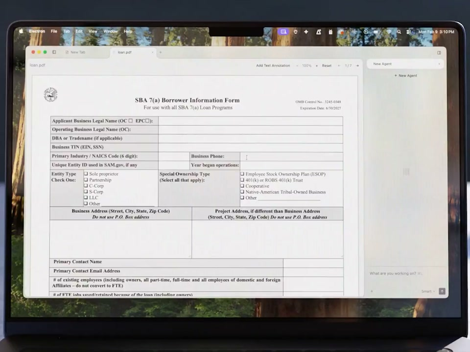

# Interpreter Workstation

**An open, neutral AI workspace for your computer.**

Interpreter Workstation is an agent workspace for a computer. The desktop app
normally connects to the computer it runs on; the same shell can also connect
to a remote computer through its shared browser bridge. Built on
[Open Interpreter](https://github.com/openinterpreter/openinterpreter), it can
use your choice of supported cloud provider or local model, and it does not
require an Interpreter account.

It is a self-hostable alternative to proprietary work agents such as Claude
Cowork and ChatGPT, without making another vendor's product the definition of
what this project can become.

[](docs/assets/interpreter-workstation-hero.mp4)

[Watch the 95-second launch film →](docs/assets/interpreter-workstation-hero.mp4)

Bring your own model, keep work local when you choose, and control which files
and applications each agent may access. Organizations can build a configured
distribution from the same source without maintaining a private fork.

## Architecture

- [Open Interpreter](https://github.com/openinterpreter/openinterpreter) owns
  the agent runtime, harnesses, provider/model discovery, and app-server
  protocol.
- This repository owns the shared Workstation shell, its desktop host, its
  browser host adapters, local policy, and workstation tools.
- Model-facing app tools use the `interpreter-app` command-line contract. The
  desktop app does not maintain a second provider or harness implementation.
- Workstation points at a backend endpoint. The renderer may be desktop or
  browser-based, the endpoint may be local or remote, and an independent
  access setting makes the interface read-write or read-only. See [Workstation hosts, browser access, and
  read-only mode](docs/remote-workstation.md).
- Native OIX [Goals](docs/goals.md) let a thread pursue a durable objective
  across long execution and context compaction.
- The browser extension and computer-use driver are pinned Git submodules so a
  desktop release is reproducible while their independent release histories are
  preserved.

## Requirements

- Node.js 22 (see `.nvmrc`)
- pnpm 9
- Bun
- Rust stable and Cargo
- Git with submodule support

## Build from source

```bash
git clone --recurse-submodules https://github.com/openinterpreter/interpreter-workstation.git
cd interpreter-workstation
pnpm install
pnpm run download:oix -- --current-platform
pnpm run download:pdfcpu -- --current-platform
pnpm run download:qwen-asr -- --current-platform
pnpm run build
pnpm start
```

The default product configuration is the account-optional community
distribution. Its hosted account, hosted API, telemetry, and external document
engine fields are empty.

## Development

```bash
pnpm dev
pnpm typecheck
pnpm run test:unit
pnpm run test:vitest
pnpm test
```

`pnpm test` also builds the app and runs Electron end-to-end coverage. Voice and
live-provider tests are opt-in because they require platform assets or external
services.

The browser extension can be bootstrapped and verified independently:

```bash
pnpm run extension:bootstrap
pnpm run extension:verify
```

## OIX runtime and shared home

Workstation installs and launches the exact checksummed OIX release pinned by
the app. Terminal OIX uses an independently movable `current` selector, so a
terminal update cannot change the app-server protocol underneath a released
Workstation build. If no terminal installation exists, Workstation exposes its
pinned release as both `interpreter` and `i`; later terminal-managed updates can
take ownership of that selector without changing the app runtime.

The app and terminal share one OIX home: `INTERPRETER_HOME` when set, otherwise
`~/.openinterpreter`. Configuration, sessions, plugins, and global skills
therefore work across both surfaces. Workstation installs and updates only the
skills it ships, preserves user and enterprise skills, and backs up local edits
before replacing a managed skill. OIX separately owns and updates its embedded
`.system` skills. See [Skills and the Open Interpreter home](docs/skills.md) and
[local OIX testing](docs/oix-local-testing.md).

## Distributions

Product-specific hosted services are configuration, not a separate application.
The official hosted profile and its release configuration are public and live
in `distribution/`; no private client fork is required. Use the distribution
wrapper for an organization-specific JSON overlay:

```bash
node scripts/with-distribution-config.mjs ./path/to/product.overlay.json -- pnpm run build
```

See [Distribution builds](docs/distributions.md) for the schema, security
boundary, privacy contract, and community/official/internal packaging model.
See [Official releases](docs/releases.md) for the signing, approval,
provenance, checksum, SBOM, and verification contract.

## Document workflows

Interpreter's primary document workflow is code execution plus skills. Community
builds also include open-source, embedded read-only viewers for DOCX, XLSX, and
PPTX files. They read local files through the app's permissioned file boundary
and render them locally; no hosted account, proprietary office suite, or
separate document service is required for viewing.

Rich embedded editing and format conversion remain optional. A compatible
document engine can be installed and configured independently when those
capabilities are needed; it is not bundled with the community source. See
[Document engines](docs/document-engine.md).

## Enterprise deployment

The application is designed to be deployable as an organization's primary AI
workstation: account-optional, provider-configurable, policy-aware, and buildable
from one canonical source tree. See [Enterprise deployment](docs/enterprise-deployment.md)
for the current controls and the remaining production-hardening checklist.

## Security

Please report vulnerabilities privately as described in [SECURITY.md](SECURITY.md).
Do not put credentials in product overlays or commit local `.env` files.

## License

Interpreter Workstation is licensed under the [Apache License 2.0](LICENSE).
Project-authored documentation is available under
[CC BY 4.0](LICENSE-DOCUMENTATION.md). See [GOVERNANCE.md](GOVERNANCE.md) for
the one-open-client and no-relicense commitments. Official-release provenance
and use of project marks are described in [TRADEMARKS.md](TRADEMARKS.md).
Pinned dependencies and submodules retain their own licenses and notices. Read
[Dependency licensing](docs/dependency-licensing.md) and the reviewed
[third-party notices](licenses/THIRD_PARTY_NOTICES.md) before distributing a
packaged binary. Every packaged app carries these notices under its `licenses/`
resource directory.
